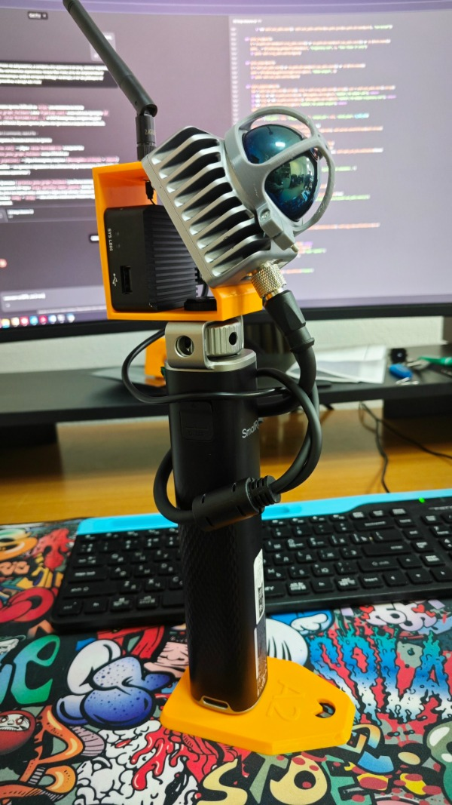
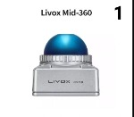
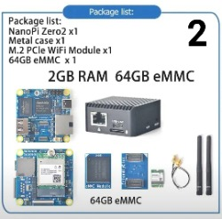
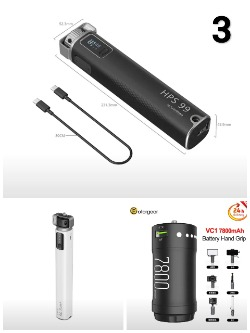
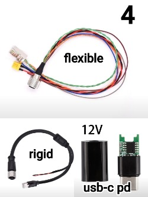
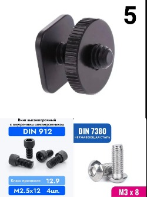
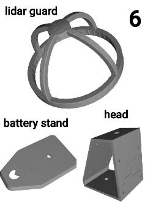

# 🔭 OpenSLAM
### DIY Architectural LiDAR SLAM Scanner

> Compact open-source 3D scanner for **architectural scanning** built with **Livox Mid-360** and **NanoPi Zero 2**.  
> Scan any space and get a full 3D point cloud ready for import into Share Studio.



📣 **Questions & support → [Telegram @a2blog](https://t.me/a2blog)**

---

## 📋 Table of Contents
- [What is this?](#-what-is-this)
- [Components](#-components)
- [3D Printed Parts](#-3d-printed-parts)
- [Assembly](#-assembly)
- [Software & Setup](#-software--setup)
- [How Scanning Works](#-how-scanning-works)
- [Roadmap](#️-roadmap)


---

## 💡 What is this?

A handheld SLAM scanner designed for architects and surveyors — capture spatial datasets and convert them for use in **Share Studio**, where point clouds are generated and processed.

The scanner is **open hardware**: source the components, 3D-print the parts, and assemble it yourself. For software, you can either handle the dataset conversion workflow on your own or contact us for setup and support.


---

## 📦 Components

<table>
  <tr>
    <td align="center" valign="top"><br/><br/><b>1. Livox Mid-360</b><br/>Main LiDAR sensor. Mid-360S also supported</td>
    <td align="center" valign="top"><br/><br/><b>2. NanoPi Zero 2</b><br/>Must have Wi-Fi module and eMMC storage</td>
    <td align="center" valign="top"><br/><br/><b>3. Powerbank</b><br/>2 outputs required: one 10W+, one with 12V or 20V PD output.<br/>Tested: <b>HPS99</b> ✅ · HPS36 and Vectorgear should work (lighter, untested)</td>
  </tr>
  <tr>
    <td align="center" valign="top"><br/><br/><b>4. LiDAR cable + USB-C PD trigger</b><br/>Rigid 0.5m (durable) or flexible 0.2m (compact).<br/>USB-C PD trigger 12V or 20V — soldered to power end</td>
    <td align="center" valign="top"><br/><br/><b>5. Fasteners</b><br/>M3×8 × 4pcs — lidar to body<br/>M2.5×12 × 4pcs — NanoPi to body<br/>1/4" flat nut × 1 — handle to body<br/>1/4" bolt × 1 — stand to powerbank</td>
    <td align="center" valign="top"><br/><br/><b>6. 3D Printed Parts</b><br/>head · lidar guard · battery stand<br/>See <a href="#%EF%B8%8F-3d-printed-parts">3D Printed Parts</a> section ↓</td>
  </tr>
</table>

> 💬 **Not sure which components to pick?** Ask in our chat — **[t.me/a2blogchat](https://t.me/a2blogchat)**
> 
> 📐 **Need a custom form factor** with this same architecture? We can design it — [write us](https://t.me/a2blogchat)

---

## 🖨️ 3D Printed Parts

| Part | File |
|------|------|
| Body | [`head.stl`](stl/head.stl) |
| LiDAR guard | [`guard.stl`](stl/guard.stl) |
| Battery stand | [`stand.stl`](stl/stand.stl) |

Material: PLA or PETG · Layer height: 0.2mm · Supports: Body only

---

## 🔧 Assembly

Only a screwdriver with bits for **M3** and **M2.5** screws needed. Assembly takes **10–15 minutes**.

▶️ [Watch assembly on YouTube Shorts](https://youtube.com/shorts/SkXs5TkPnAA?si=5-Hhbowyo1oytG3z)

---

## 💻 Software & Setup

The repository includes ready-to-use software in the [`/software`](software/) folder:

| File | Description |
|------|-------------|
| `openslam.apk` | Android app — start/stop scanner, monitor status |
| `converter_v2.4.4.exe` | Converts scan output to Share Studio format (**v2.4.4**, may update) |

### Option A — Contact us for setup (recommended)

We flash the board, configure everything, and the software above works out of the box.

**→ [Write us on Telegram @a2blog](https://t.me/a2blog)**

### Option B — DIY setup

If you want to configure everything yourself, here's what needs to be done on the NanoPi Zero 2:

1. [Install ROS 2 Humble](https://docs.ros.org/en/humble/Installation.html)
2. [Install Livox SDK](https://github.com/Livox-SDK/livox_ros_driver)
3. [Install Livox ROS Driver 2](https://github.com/Livox-SDK/livox_ros_driver2)
4. Write a script for automatic scan start/stop
5. Configure and broadcast a Wi-Fi access point on the board
6. Develop a smartphone app to control start/stop over Wi-Fi
7. Develop a converter to transform scan output into a Share Studio-compatible format

> This is a non-trivial setup. If you're not sure — [just ask us](https://t.me/a2blog), it's faster.

---

## 📡 How Scanning Works

▶️ [Full process — from power-on to point cloud (YouTube Shorts)](https://youtube.com/shorts/bw-Ms9yZcY4?si=9ZZbCUVC4t5Bi-bY)

> The section below applies to the **our setup** version (APK + converter). If you configured everything yourself — you have your own pipeline.

### Starting a scan

1. Connect the powerbank — scanning starts automatically
2. Wait **5 seconds** with the scanner still and flat before picking it up
3. Slowly lift it and start walking through the space
4. To stop: use the **app** or simply disconnect the power

### Connecting the app

1. Disable VPN and mobile data on your phone
2. Connect to Wi-Fi network **A2-scanner**, password `12345678`
3. Open the app — once the LiDAR is powered on you'll see the filename, file size growing in real time, and recording duration
4. The app also shows scanning recommendations during capture

▶️ [App interface and scanning tips (YouTube Shorts)](https://youtube.com/shorts/_l46X66WYL8?si=aoAQ2SCx_Rhjt1gZ)

### Getting your data

1. Insert a USB drive into the NanoPi's USB port
2. Copy the scan file via the app
3. Run `converter_v2.4.4.exe` on PC to convert the file
4. Import into **Share Studio** and build the point cloud

---

## 📁 Repository Structure

```
OpenSLAM/
├── README.md
├── stl/
│   ├── head.stl
│   ├── guard.stl
│   └── stand.stl
├── software/
│   ├── openslam.apk
│   └── converter_v2.4.4.exe
└── images/
    ├── resized-1.jpg
    ├── resized-2.jpg
    ├── resized-3.jpg
    ├── resized-4.jpg
    ├── resized-5.jpg
    ├── resized-5.jpg
    └── scanner.jpg
```

---

## 🛣️ Roadmap

This is not a finished project — it's an actively evolving platform.

The current version delivers clean LiDAR-only point clouds. Here's what's coming:

| Feature | Status | What it gives you |
|---------|--------|-------------------|
| **RTK GPS integration** | 🔄 In progress | Geo-referenced point clouds placed directly into world coordinate systems |
| **Insta360 camera integration** | 🔄 In progress | Full-color point clouds using 8K 360° video — every point gets its real color |

Once both sensors are integrated, OpenSLAM will produce **colored, geo-referenced 3D scans** out of the box — no post-processing, no external reference points needed.

> 📣 Follow updates in our Telegram — **[t.me/a2blog](https://t.me/a2blog)**


---

## 📄 License

MIT License — free to use, modify, and share. See [`LICENSE`](LICENSE).


---

## 💬 Contact

**[Telegram @a2blog](https://t.me/a2blog)** — questions, setup requests, feedback.  
If this helped you, give the repo a ⭐
