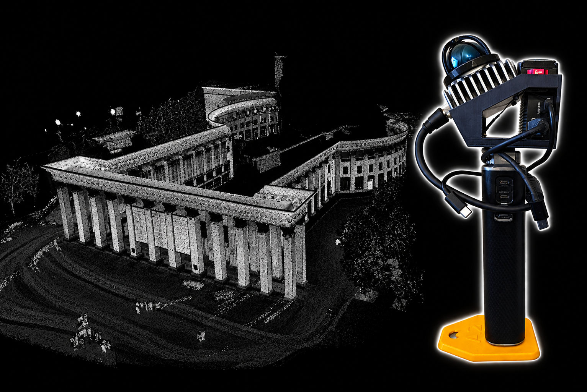
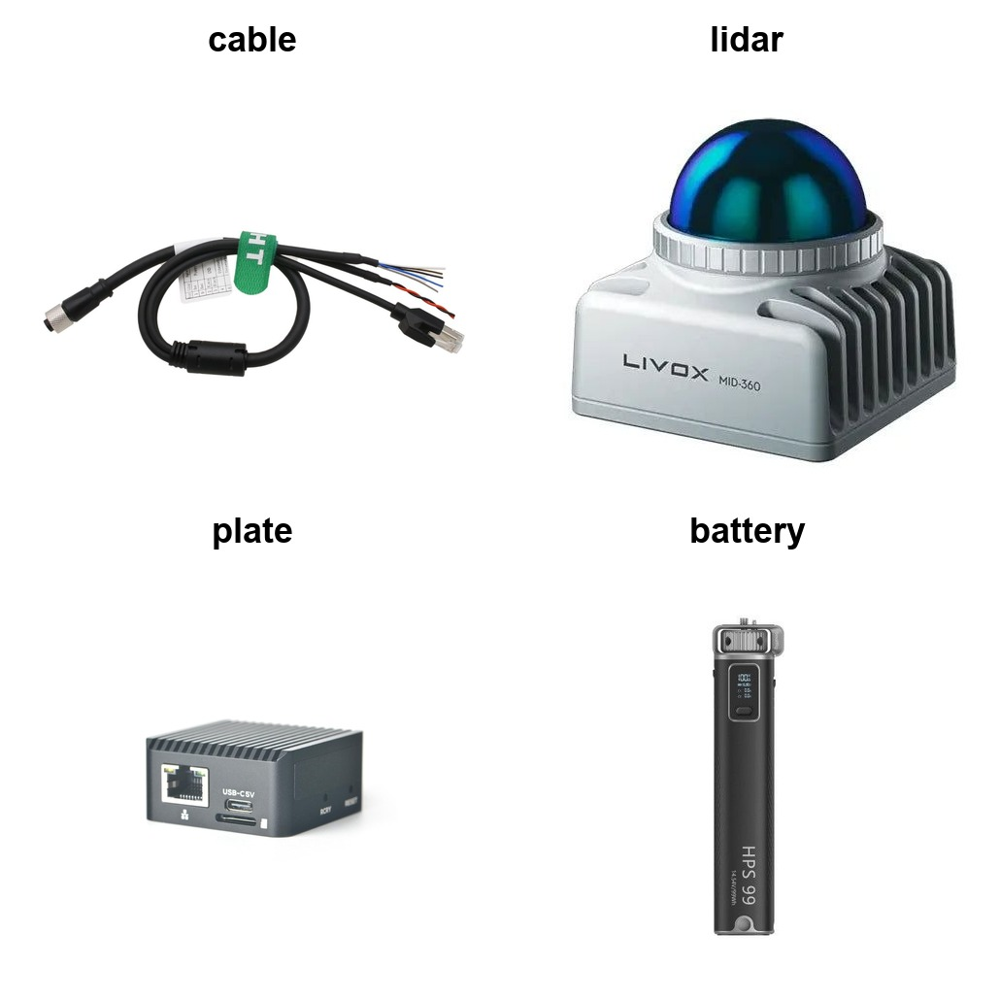
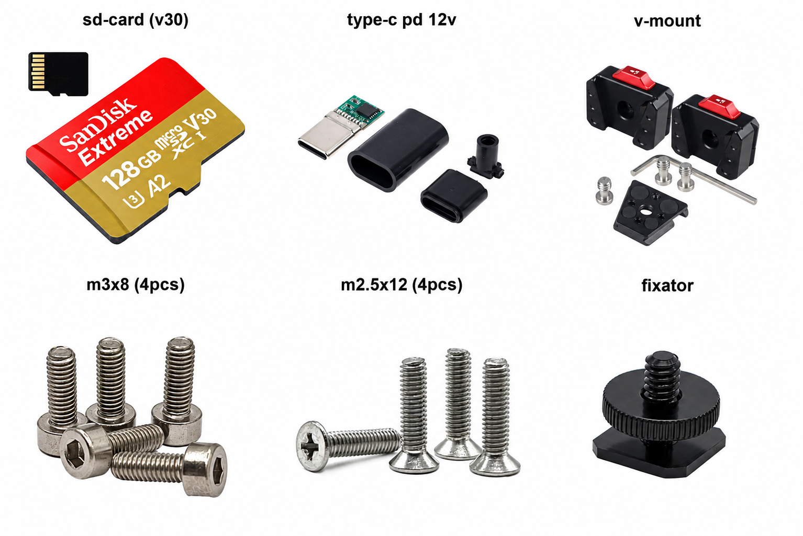
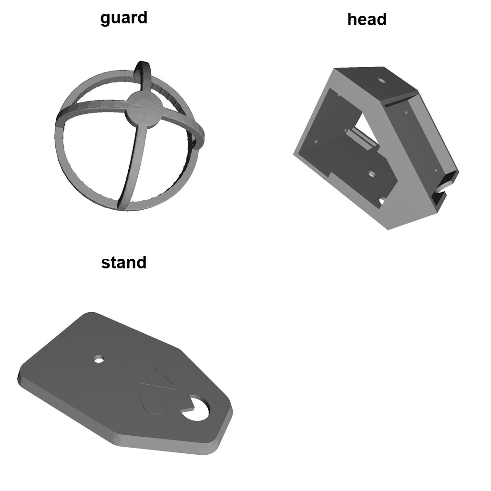
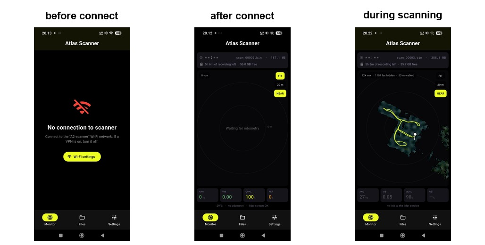
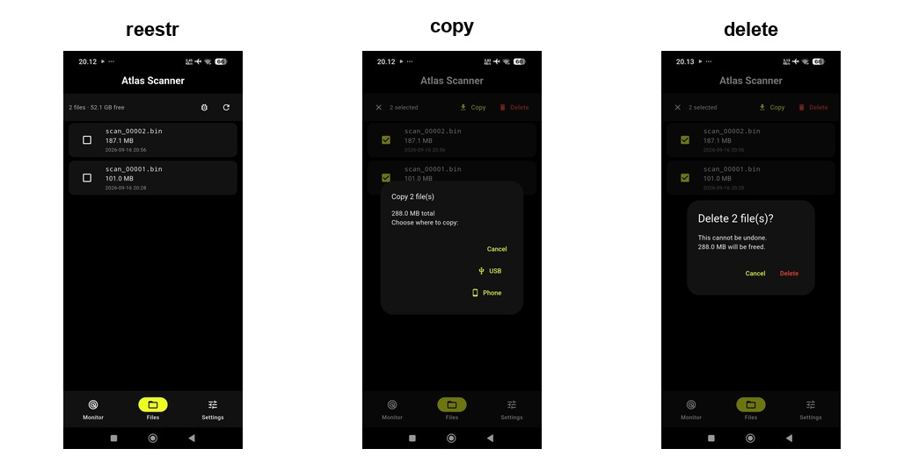
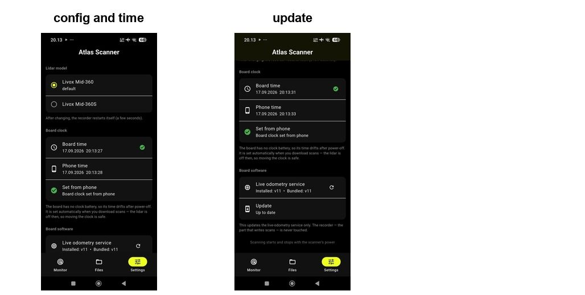
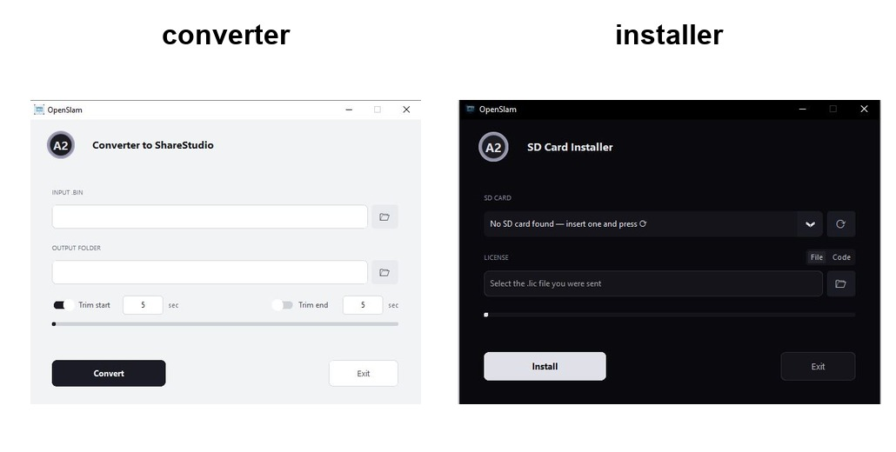

# 🔭 OpenSLAM
### DIY Architectural & Surveying LiDAR SLAM Scanner

> Compact open-source 3D scanner for **architectural and surveying work** built with **Livox Mid-360** and **NanoPi Zero 2**.
> Scan any space and get a full 3D point cloud ready for import into Share Studio.



📣 **Questions & support → [Telegram @a2blog](https://t.me/a2blog)**

---

## 📋 Table of Contents
- [What's New](#-whats-new)
- [What is this?](#-what-is-this)
- [Components](#-components)
- [3D Printed Parts](#-3d-printed-parts)
- [Assembly](#-assembly)
- [Software & Setup](#-software--setup)
- [How Scanning Works](#-how-scanning-works)
- [Panorama Color & Tours](#-panorama-color--tours)
- [Previous Version](#-previous-version)
- [Roadmap](#️-roadmap)

---

## 🆕 What's New

- **Storage: eMMC → microSD.** The board no longer needs a special eMMC-equipped NanoPi. Any regular NanoPi Zero 2 works — scans are written to a plain microSD card (**64GB+, U3/V30 or faster**). Cheaper board, easier to source, and the card itself is now a swappable, off-the-shelf part.
- **App rewritten.** The Monitor screen now draws a **live point cloud + trajectory in plan view** while you walk, shows scanning-quality metrics, and — the thing everyone actually wants to know in the field — **how much recording time is left**, in hours and minutes, based on free space. Files got multi-select copy/delete. Settings got lidar model switching, setting the board's clock from your phone, and updating the scanner's onboard software right from the app (see below).
- **Converter takes a whole folder now.** `A2 Bin to ShareStudio.exe` accepts **multiple `.bin` files at once**, and can now trim **both the start and the end** of a recording (previously only the start).
- **Remote setup got its own tool.** If you go with Option A (contact us for setup), we now flash and configure your SD card in a **remote session with a dedicated installer** — faster and more consistent than manual steps over chat.
- **Panorama integration is done.** Insta360 camera support is complete and working well — point clouds get their real color, and full panoramic tours build cleanly. Demo: **[tour.a2-lab.ru/dtyevqr7nd7a](https://tour.a2-lab.ru/dtyevqr7nd7a/)**. A separate repo update is coming for Insta360-based **E57 panorama generation**, in addition to point-cloud coloring — see [Panorama Color & Tours](#-panorama-color--tours).

Older hardware (eMMC board) and the previous app/converter are **not deleted** — see [Previous Version](#-previous-version).

---

## 💡 What is this?

A handheld SLAM scanner designed for **architects, surveyors, and construction professionals** — capture spatial datasets and convert them for use in **Share Studio**, where point clouds are generated and processed.

The scanner is **open hardware**: source the components, 3D-print the parts, and assemble it yourself. For software, you can either handle the dataset conversion workflow on your own or contact us for setup and support.

---

## 📦 Components



| Part | Notes |
|------|-------|
| **Livox Mid-360** | Main LiDAR sensor. Mid-360S also supported |
| **NanoPi Zero 2** | Wi-Fi module required. **No eMMC needed anymore** — see storage below |
| **microSD card** | **64GB minimum, U3/V30 (or faster) speed class.** This is the scanner's storage now — regular eMMC boards are no longer required |
| **Powerbank** | 2 outputs required: one 10W+, one with 12V or 20V PD output. Tested: **HPS99** ✅ · HPS36 should work (lighter, untested) |
| **LiDAR cable + USB-C PD trigger** | Rigid 0.5m (durable) or flexible 0.2m (compact). USB-C PD trigger 12V or 20V — soldered to power end |



| Part | Notes |
|------|-------|
| **microSD card (V30)** | See storage requirement above — this is the card itself |
| **USB-C PD trigger board** | Wired into the power cable, sets the powerbank's output voltage |
| **V-mount plate (optional)** | Only needed if you're mounting a panorama camera on top — see [Panorama Color & Tours](#-panorama-color--tours) |
| **M3×8 × 4pcs** | LiDAR to body |
| **M2.5×12 × 4pcs** | NanoPi to body |
| **Fixator (1/4" screw)** | Handle / tripod mount |

> 💬 **Not sure which components to pick?** Ask in our chat — **[t.me/a2blogchat](https://t.me/a2blogchat)**
>
> 📐 **Need a custom form factor** with this same architecture? We can design it — [write us](https://t.me/a2blogchat)

---

## 🖨️ 3D Printed Parts



| Part | File |
|------|------|
| Head (redesigned) | [`head.stl`](stl/head.stl) |
| LiDAR guard | [`guard.stl`](stl/guard.stl) |
| Battery stand | [`stand.stl`](stl/stand.stl) |
| Cover LiDAR | [`cover.stl`](stl/cover.stl) |

Material: PLA or PETG · Layer height: 0.2mm · Supports: Body only

> The **head** was redesigned for the new build — if you printed the old one for an eMMC-era board, it still works, but grab the new [`head.stl`](stl/head.stl) for new builds.

---

## 🔧 Assembly

Only a screwdriver with bits for **M3** and **M2.5** screws needed. Assembly takes **5–10 minutes**.

▶️ [Watch assembly on YouTube Shorts](https://youtube.com/shorts/SkXs5TkPnAA?si=5-Hhbowyo1oytG3z)

---

## 💻 Software & Setup

The repository includes ready-to-use software in the [`/software`](software/) folder:

| File | Description |
|------|-------------|
| [Share Studio](https://drive.google.com/file/d/1ULAfoiqowkNw1V6ztaFk67XhTIfReGN7/view?usp=drive_link) | Point cloud processing software — generates the final point cloud from the converted scan |
| [`AtlasScanner.apk`](software/AtlasScanner.apk) | Android app — connect to the scanner, watch the live map and metrics, manage files, update the scanner's software |
| [`A2 Bin to ShareStudio.exe`](software/A2%20Bin%20to%20ShareStudio.exe) | Converts scan output to Share Studio format. Now takes multiple `.bin` files at once, trims start **and end** |
| [`A2 SD Card Installer.exe`](software/A2%20SD%20Card%20Installer.exe) | Flashes and configures a microSD card — used for remote setup (Option A below) |

### App screens



**Monitor** — before connecting, after connecting, and during a scan. While scanning it draws a live plan-view point cloud with your walked trajectory, four quality metrics (angular rate, vibration, point quality, return rate), and **how much recording time is left**, in hours and minutes, based on free space on the card.



**Files** — the scan list with free space at a glance, multi-select **Copy** (to USB or straight to your phone) and **Delete** with a confirmation.



**Settings** — pick the lidar model config (Mid-360 / Mid-360S), set the board's clock from your phone, and update the scanner's onboard software right from the app. **New scanner updates will be delivered this way going forward** — no more separate tools or manual flashing for software-only changes.

### Converter & remote installer



The converter now accepts a **batch of `.bin` files** in one go, and can trim both the **start** and the **end** of a recording. The installer is what we use to remotely flash and configure your microSD card (Option A).

### Option A — Contact us for setup (recommended)

We flash the card, configure everything, and the software above works out of the box. Setup now happens in a short **remote session** using the SD Card Installer tool above — quick and consistent.

**→ [Write us on Telegram @a2blog](https://t.me/a2blog)**

### Option B — DIY setup

If you want to configure everything yourself, here's what needs to be done on the NanoPi Zero 2:

1. [Install ROS 2 Humble](https://docs.ros.org/en/humble/Installation.html)
2. [Install Livox SDK](https://github.com/Livox-SDK/livox_ros_driver)
3. [Install Livox ROS Driver 2](https://github.com/Livox-SDK/livox_ros_driver2)
4. Write a script for automatic scan start/stop
5. Configure and broadcast a Wi-Fi access point on the board
6. Develop a smartphone app to control start/stop over Wi-Fi
7. Develop a converter to transform scan output into a Share Studio-compatible format

> This is a non-trivial setup. If you're not sure — [just ask us](https://t.me/a2blog), it's faster.

---

## 📡 How Scanning Works

▶️ [Full process — from power-on to point cloud (YouTube Shorts)](https://youtube.com/shorts/bw-Ms9yZcY4?si=9ZZbCUVC4t5Bi-bY)

> The section below applies to the **our setup** version (APK + converter). If you configured everything yourself — you have your own pipeline.

### Starting a scan

1. Connect the powerbank — scanning starts automatically
2. Wait **5 seconds** with the scanner still and flat before picking it up
3. Slowly lift it and start walking through the space
4. To stop: use the **app** or simply disconnect the power

### Connecting the app

1. Disable VPN and mobile data on your phone
2. Connect to Wi-Fi network **A2-scanner**, password `12345678`
3. Open the app — once the LiDAR is powered on you'll see a live map of the space, quality metrics, and recording time left
4. The app also shows scanning recommendations during capture

▶️ [App interface and scanning tips (YouTube Shorts)](https://youtube.com/shorts/_l46X66WYL8?si=aoAQ2SCx_Rhjt1gZ) *(recorded on an earlier app version — the flow is the same, the screens now show more)*

### Getting your data

1. Copy the scan straight from the app — to a **USB drive** plugged into the NanoPi, or **directly to your phone**
2. Run `A2 Bin to ShareStudio.exe` on your PC to convert the file(s) — a whole folder at once if you like
3. Import into **Share Studio** and build the point cloud

### Accuracy vs total station

▶️ [SLAM scanner vs total station — measurement accuracy comparison (YouTube)](https://youtu.be/1wsdnFhcVqg?si=2cW65tGUr027HEWM)

Independent comparison of OpenSLAM point cloud data against total station survey measurements — useful if you're evaluating the scanner for surveying applications.

---

## 🎨 Panorama Color & Tours

Insta360 camera integration is **complete** — mount a panorama camera on the optional V-mount plate, and the pipeline colors the point cloud from the 360° footage and builds a full panoramic tour.

▶️ **[Live demo — colorized point cloud + panoramic tour](https://tour.a2-lab.ru/dtyevqr7nd7a/)**

A separate repository update is coming for Insta360-based **E57 panorama generation**, in addition to the point-cloud coloring shown above.

---

## 🗄️ Previous Version

The eMMC-based hardware revision and the older app/converter are **kept, not deleted** — they're tagged and archived as a GitHub Release so you can still reach them if you need to roll back or you're maintaining an older unit:

**→ [Legacy release: eMMC board, old app & converter](../../releases/tag/legacy-emmc-2026-09)**

Everything on this page (main branch) is the current, actively maintained version.

---

## 📁 Repository Structure

```
OpenSLAM/
├── README.md
├── stl/
│   ├── head.stl
│   ├── guard.stl
│   ├── cover.stl
│   └── stand.stl
├── software/
│   ├── AtlasScanner.apk
│   ├── A2 Bin to ShareStudio.exe
│   └── A2 SD Card Installer.exe
└── images/
    ├── hero.png
    ├── components-main.jpg
    ├── components-small.jpg
    ├── components-printed.jpg
    ├── app-monitor.jpg
    ├── app-files.jpg
    ├── app-settings.jpg
    ├── converter-installer.jpg
    ├── converter-detail.jpg
    └── sd-installer-detail.jpg
```

---

## 🛣️ Roadmap

This is not a finished project — it's an actively evolving platform.

Point clouds are colored and panorama tours already work end to end. Here's what we're building toward by the end of the year:

| Feature | Status | What it gives you |
|---------|--------|-------------------|
| **GNSS integration** | 🔄 In progress | Geo-referenced point clouds placed directly into world coordinate systems |
| **Ground control points (GCP)** | 🔄 Planned | Mark surveyed reference points during a scan to correct drift between them |
| **Own SLAM engine** | 🔄 In progress | Nearing quality parity with Share Studio — moving toward an end-to-end in-house pipeline |
| **Web service for cloud uploads** | 🔄 Planned | Upload point clouds — including colored, panorama-tagged ones — straight from the field |

> 📣 Follow updates in our Telegram — **[t.me/a2blog](https://t.me/a2blog)**

---

## 📄 License

MIT License — free to use, modify, and share. See [`LICENSE`](LICENSE).

---

## 💬 Contact

**[Telegram @a2blog](https://t.me/a2blog)** — questions, setup requests, feedback.

**Commercial inquiries** (board setup, scanner assembly, custom builds) — [a2-pik@yandex.com](mailto:a2-pik@yandex.com)

If this helped you, give the repo a ⭐
